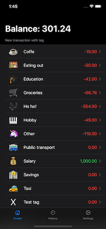
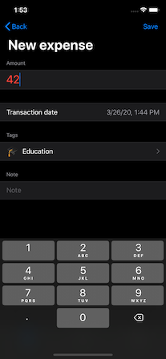
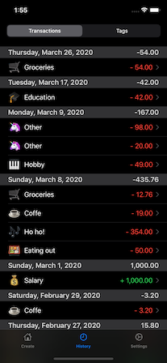
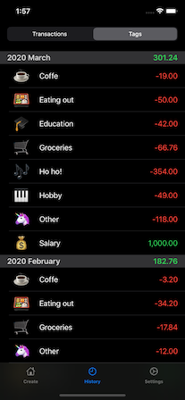

#  Simple expenses tracker app for iOS

## Motivation

I wanted to have a simple way to track how much I pay for some categories of goods during every month and check the dynamics. After trying a few apps on appstore I started to use one which looked enough for my needs. With some UX issues it is a decent app and I used it for about two months.
The biggest issue with the app was freeze up to one minute at start time which is really annoying when you are going to spend around 10 seconds on adding a new expense right in a store. After a few experiments without luck I started to think what to do.

But wait, I am a developer! Why not create an app by myself 🤔? And that's how it's started.

Almost at the same time I noticed SwiftUI from Apple and decided it would be a good project to try.

## Screenshots

## There were some initial requirements for the app
 - [x] As less clicks as possible to track an expense. Currently it's tap on a tag -> input amount -> save.
 - [x] Multiple tags for an expense/income. I do not use it yet but the app is ready to support it.
 - [x] Edit a transaction in the past.
 - [x] See current months expenses by tags and history for previous months.
 - [ ] Budgets. Did not decide yet if I really need it or not, but for the release it seems reasonable.
 - [ ] Tags hierarchy. Every tag may have a parent tag to have more general overview of transactions e.g. transport -> (public | taxi | (car -> fuel|service) )

## Technical details
 - Swift
 - SwiftUI
 - CoreData
 - Fastlane

